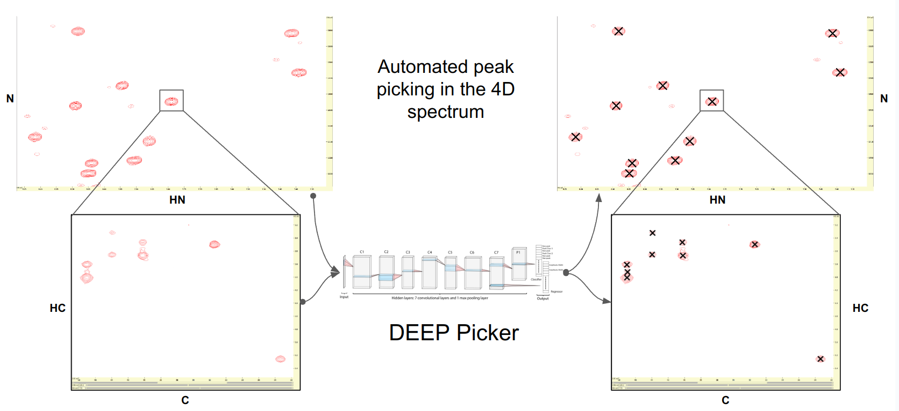

# Automated Peak Picking for High-Dimensional NMR Spectra

Welcome to this repository, which is dedicated to providing or enhancing open-source code for automated peak picking in 
4D and 3D NMR spectra. Our goal is to facilitate the analysis of complex NMR data through automation, making it easier and faster for researchers to interpret their results.

## Concept

The core of this repository's code utilizes the `ucsfdata` command-line utility from [NMRFAM Sparky](https://nmrfam.wisc.edu/nmrfam-sparky-distribution/) to slice high-dimensional 
NMR spectra and create two-dimensional planes for peak picking using the [DEEP Picker algorithm](https://github.com/lidawei1975/deep) 
from [Li et al., 2021 Nature Communications](https://www.nature.com/articles/s41467-021-25496-5). 
In addition to this approach, there is a version under development that leverages the 
[nmrglue](https://nmrglue.readthedocs.io/en/latest/index.html) Python library for slicing 
instead of `ucsfdata`.

## Depedencies

You must install the following software:
* [NMRFAM Sparky](https://nmrfam.wisc.edu/nmrfam-sparky-distribution/). Make sure that the command line utility 
    `ucsfdata` is in your **PATH**. That's all you need from Sparky.
* [DEEP Picker algorithm](https://github.com/lidawei1975/deep). Compile it and make sure that the executable 
  `deep_picker` is in your **PATH**

### Supported Experiments

Currently, the code supports the following NMR experiments:

- **4D HCNH NOESY**: The code performs quite reasonably with this type of spectra.
- **CBCAcoNH**: Although it selects many peaks, most are identified as noise.

For both cases you need to have also a **[15N,1H]-HSQC** or **[15N,1H]-BEST-TROSY** for referencing of peaks at the N 
and HN dimensions.

### Getting Started

To try out the automated peak picking, you can download example spectra from the provided link. Follow the instructions below to run the scripts for each supported NMR experiment.

#### 4D HCNH NOESY

1. Download the example spectra.
2. Edit the file paths at the beginning of `EXEC_4D_HCNH_NOESY_picker.py` to match your system.
3. Execute the script to perform automated peak picking.

#### CBCAcoNH

1. For peak picking of CBCAcoNH spectra, edit the script `EXEC_CBCAcoNH_picker_slice_sel_nucleus.py`.
2. This script slices at a selected nucleus dimension and calls DEEP picker under the hood to pick peaks on the 2D planes of the other two dimensions.
3. By default, slicing occurs at the amide nitrogen dimension, but you can select any nucleus for slicing.

## Contributions and Licensing

#### Author: Thomas Evangelidis

This repository is meant to be enhanced and updated periodically. Contributions are welcome, and all the codes within 
this repository are open-source, governed by the **GPL version 3 license**.

Your feedback, suggestions, and contributions will help us improve this tool and support more experiments in the future.
